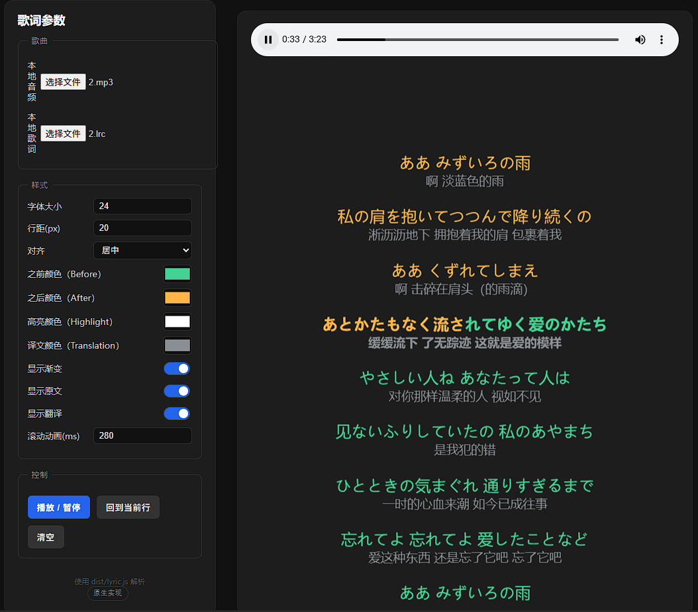

[English](./README-en.md)

# @jyostudio/lyric



一个纯 TypeScript 实现的歌词解析与渲染组件库，包含：
- 核心解析与控制模块：`dist/lyric.js`（默认导出 `Lyric`，命名导出 `LyricController`）
- 原生 Web Component：`dist/jyo-lyric.js`（自定义元素 `<jyo-lyric>`）

支持多种主流歌词格式：LRC、TRC、KRC、KSC、QRC（自动识别优先级：QRC → KRC → KSC → TRC → LRC）。

## 安装

```bash
npm install @jyostudio/lyric
# 或
pnpm add @jyostudio/lyric
# 或
yarn add @jyostudio/lyric
```

CDN：
- jsDelivr: https://cdn.jsdelivr.net/npm/@jyostudio/lyric/dist/lyric.js
- unpkg: https://unpkg.com/@jyostudio/lyric/dist/lyric.js

> 构建产物为 ESM，适用于现代打包器与浏览器 `<script type="module">`。

---

## 快速开始

### 1) 核心解析与控制（`lyric.js`）

适用于 Node.js（23+）与浏览器。默认导出 `Lyric`，命名导出 `LyricController`。该包为 ESM-only。

```ts
// ESM
import Lyric, { LyricController } from '@jyostudio/lyric';

// 方式 A：从 URL 直接创建（浏览器）
const lyric = await Lyric.createFromUri('/path/to/foo.lrc');

// 方式 B：从 ArrayBuffer 创建
// Node: 使用 fs 读取 Buffer 并转为 ArrayBuffer
// import { readFile } from 'node:fs/promises';
// const buf = await readFile('foo.krc');
// const ab = buf.buffer.slice(buf.byteOffset, buf.byteOffset + buf.byteLength);
// const lyric = new Lyric(ab);

// 推进时间（单位：毫秒）并获得当前行/词索引
const { lineIndex, wordIndex } = lyric.setCurrentTime(120_000); // 120s

// 也可用控制器封装（单位：毫秒）
LyricController.updateByTime(lyric, 120_000);

// 渲染用：获取行与词
for (const line of lyric.lines) {
  // line.startTime, line.duration, line.state: 'past'|'current'|'future'
  // line.progress, line.renderProgress
  for (const word of line.words) {
    // word.text, word.duration, word.state, word.progress
  }
}
```

生成其他格式（导出为 `ArrayBuffer`）：

```ts
// 支持：'lrc' | 'trc' | 'qrc' | 'krc' | 'ksc'
const ab = Lyric.generate(lyric, 'lrc');

// 浏览器：下载为文件
const blob = new Blob([ab], { type: 'text/plain;charset=utf-8' });
const a = document.createElement('a');
a.href = URL.createObjectURL(blob);
a.download = 'output.lrc';
a.click();

// Node：写入磁盘
// import { writeFile } from 'node:fs/promises';
// await writeFile('output.lrc', Buffer.from(new Uint8Array(ab)));
```

辅助：判断一行是否支持逐字（词级时间轴）

```ts
import Lyric from '@jyostudio/lyric';

const supports = Lyric.supportsPerWord(lyric.lines[0]); // boolean
```

### 2) Web Component（`jyo-lyric.js`）

开箱即用的自定义元素 `<jyo-lyric>`，负责将 `Lyric` 的结构渲染到页面，并内置平滑滚动、逐字渐变、拖动回看等交互。

- 安装后在打包器里直接引入：

```ts
// 注册自定义元素（副作用导入即可）
import '@jyostudio/lyric/dist/jyo-lyric.js';
```

- 或使用 CDN：

```html
<script type="module" src="https://cdn.jsdelivr.net/npm/@jyostudio/lyric/dist/jyo-lyric.js"></script>
```

- 最小示例：

```html
<jyo-lyric id="view" src="/music/foo.lrc" align="center" font-size="24" line-gap="20"
  style="display:block;height:420px;--colorBefore:#42d392;--colorAfter:#ffb347;--colorHighlight:#fff;--colorTranslation:#8a8f95;"></jyo-lyric>
<script type="module">
  const audio = document.querySelector('audio');
  const view = document.getElementById('view');
  // 用 rAF 驱动，保证逐字平滑；注意：组件的 setCurrentTime 接受“秒”
  let raf = 0;
  const tick = () => { view.setCurrentTime(audio.currentTime || 0); raf = requestAnimationFrame(tick); };
  audio.addEventListener('play', () => { cancelAnimationFrame(raf); tick(); });
  audio.addEventListener('pause', () => cancelAnimationFrame(raf));
  audio.addEventListener('seeking', () => view.setCurrentTime(audio.currentTime || 0));
</script>
```

#### 组件属性（Attributes）
- `src`: 歌词文件 URL（支持 .lrc/.trc/.krc/.ksc/.qrc）
- `align`: 文本对齐，`left|center|right`，默认 `center`
- `font-size`: 行字号（px），默认 `24`
- `line-gap`: 行距（px），默认 `20`
- `scroll-ms`: 自动滚动动画时长（ms），默认 `280`
- `gradient`: 是否显示渐变高亮，`true|false`，默认 `true`
- `show-lang1`: 是否显示主文本，默认 `true`
- `show-lang2`: 是否显示副文本（翻译、第二行），默认 `true`
- `show-refline`: 参考线显隐：`true|false`，缺省为“交互中自动显示”

#### 公共方法（DOM 实例方法）
- `setColors({ before?, after?, highlight?, translation? })`: 设置主题色（对应下方 CSS 变量）
- `loadFromUrl(url: string)`: 从 URL 加载歌词
- `loadFromText(text: string)`: 从纯文本加载歌词
- `loadFromBuffer(buf: Uint8Array)`: 从二进制数据加载歌词
- `clear()`: 清空数据
- `setCurrentTime(seconds: number)`: 设置当前播放时间（单位：秒）
- `scrollToCurrent(immediate?: boolean)`: 滚动至当前行（可选：是否无动画）

> 注意：组件的 `setCurrentTime` 参数是“秒”；若使用核心类 `Lyric.setCurrentTime`，单位是“毫秒”。

#### 事件（CustomEvent）
- `linechange`: `{ index, previousIndex }`
- `wordchange`: `{ lineIndex, index }`
- `seeked`: `{ time }`（与 `setCurrentTime` 同步触发）

#### 样式定制
- CSS 变量：
  - `--colorBefore`：未播放颜色，默认 `#42d392`
  - `--colorAfter`：已播放颜色，默认 `#ffb347`
  - `--colorHighlight`：当前高亮颜色，默认 `#fff`
  - `--colorTranslation`：翻译文本颜色，默认 `#8a8f95`
  - `--bg`：容器背景色
  - `--reflineColor`：参考线颜色（`show-refline` 时）
- Shadow Parts：`wrapper`、`inner`、`row`、`primary`、`secondary`、`refline`、`refslots`、`ref-left`、`ref-center`、`ref-right`
- Slots：`before`、`after`、`ref-left`、`ref-center`、`ref-right`（对齐于参考线，可放置按钮/标签等）

示例：

```css
jyo-lyric::part(row) { letter-spacing: 0.3px; }
jyo-lyric { --bg: #0d0d0d; --reflineColor: rgba(255,255,255,.16); }
```

---

## 在浏览器直接使用（无打包器）

仅用 WebComponent：

```html
<script type="module" src="https://cdn.jsdelivr.net/npm/@jyostudio/lyric/dist/jyo-lyric.js"></script>
<jyo-lyric src="./music/1.lrc" style="display:block;height:420px;"></jyo-lyric>
```

仅用核心解析：

```html
<script type="module">
  import Lyric from 'https://cdn.jsdelivr.net/npm/@jyostudio/lyric/dist/lyric.js';
  const lyric = await Lyric.createFromUri('./music/1.lrc');
  lyric.setCurrentTime(12_345); // ms
  console.log(lyric.lines[lyric.setCurrentTime(12_345).lineIndex]);
</script>
```

---

## TypeScript 支持

源码基于 TypeScript 实现，提供完备的类型注释与合理的推断体验。若你在纯 TS 项目中使用，可直接按上文导入。

> 注：后续版本将补充正式的 `.d.ts` 声明文件导出，以便编辑器跳转与 API 辅助更完善。

---

## 本地开发与示例

- 安装依赖并构建：

```bash
npm install
npm run build
```

- 打开示例（建议用任意静态服务器打开 `demo/index.html`，确保 `fetch` 可访问资源）：

```bash
# 任选其一
npx http-server demo
npx serve demo
```

浏览器访问对应地址即可（示例默认使用 `dist/jyo-lyric.js`）。

---

## 常见问题

- Q：为什么我在组件里传的是“秒”？
  - A：Web Audio/HTMLAudioElement 的 `currentTime` 单位是秒，组件为了直连播放器，`setCurrentTime` 采用秒；核心类与控制器使用毫秒以获得更精细的时间分辨率。

- Q：如何判断是否支持逐字（词级时间轴）？
  - A：使用静态方法 `Lyric.supportsPerWord(line)`。

- Q：如何关闭渐变，仅用纯色高亮？
  - A：给组件设置 `gradient="false"`，同时可通过 `--colorHighlight` 控制当前行/词颜色。

---

## 许可

MIT © Jyo Studio
